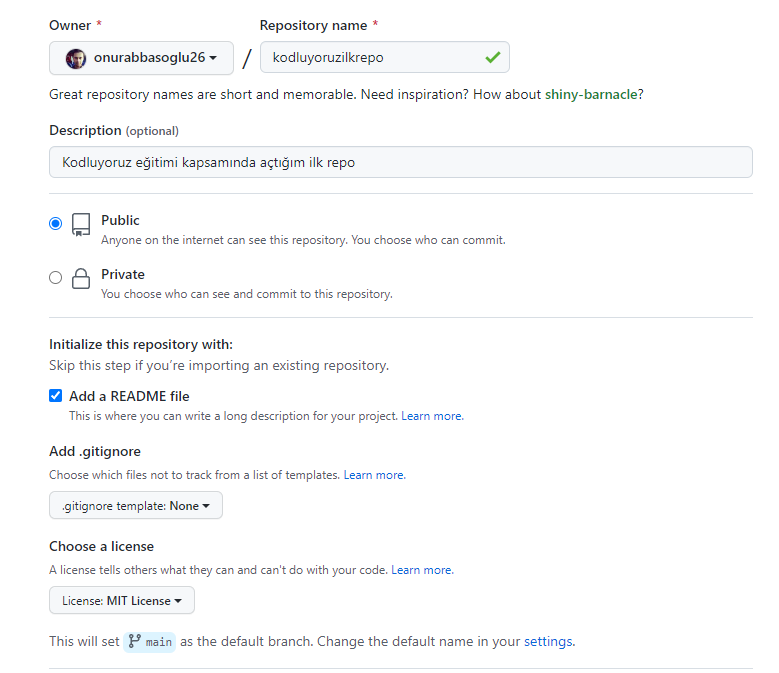

# Kodluyoruz İlk Repo
Bu repo [Kodluyoruz](https://kodluyoruz.org) Front-End eğitiminde oluşturduğumuz ilk repo. İçerisinde bir adet README dosyası, bir adet de index.html barındıryor.



# Installation

Öncelikle projeyi klonayın.

```
git clone https://github.com/onurabbasoglu26/kodluyoruzilkrepo
```

# Usage

Projeyi klondalıktan sonra Visial Studio Code programında açınız.

Linux için:

```
cd kodluyoruzilkrepo
code .
```

# Constributing

Pull requestler kabul edilir. Büyük değişlikler için, lütfen önce neyi değiştirmek istediğinizi tartışmak için bir konu açınız.

# License

[MIT](https://choosealicense.com/licenses/mit/)